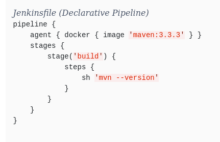

# Jenkins

## Objetivo
Crear un pipeline orientado al deploy de un Sistema de seminarios.

## Flujo de deployment
1. Cambios sobre un código.
2. Detección de push sobre Github.
3. Creación de imagen UAT Docker.
4. Tag y push imagen UAT Docker sobre Harbor.
5. Pull de imagen y creación de contenedor UAT.
6. Validar funcionamiento del contenedor UAT.
7. Validar cambios sobre el código.
8. Tag y push imagen Productivo Docker sobre Harbor.
9. Pull de imagen y creación de contenedor Productivo.

## Dependencias

### Credenciales
Alta de credenciales de acceso a VMs

### Plugins

#### Blue Ocean

Permite crear y visualizar pipelines de forma más interactiva.

#### SSH plugin

Permite realizar conexiones ssh remotas.

#### Pipeline

Permite la creación de un archivo Jenkins para la ejecución de un pipeline.

